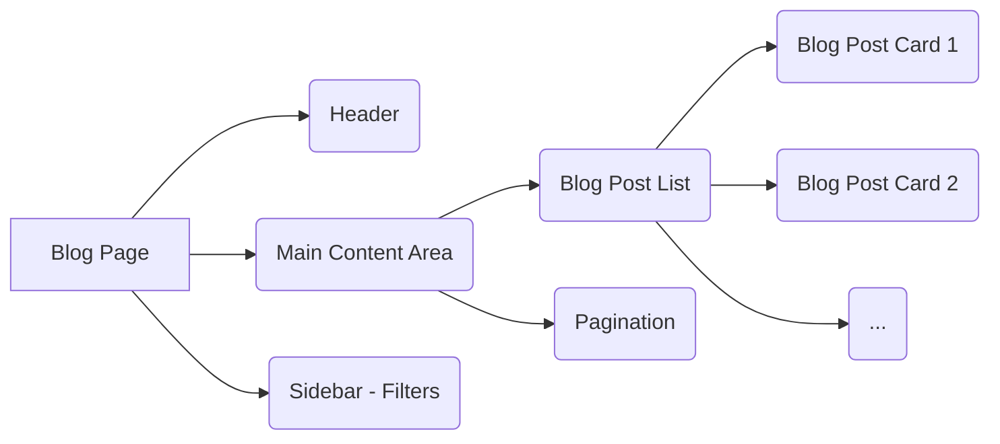

# Blog Page Design Concept

This document outlines the proposed design for the blog page, including the overall layout, the structure and appearance of blog post cards, and the functionality and appearance of the filter block.

## Overall Page Layout

The blog page will feature a two-column layout on larger screens, transitioning to a single column on smaller screens.

*   **Main Content Area (Left Column):** This will display the list of blog post cards and pagination.
*   **Sidebar (Right Column):** This will contain the filter options. On smaller screens, the filter options will likely collapse into an off-canvas menu or an expandable section at the top of the page.

## Blog Post Card Structure and Appearance

The existing `BlogPostCard.tsx` component provides a good starting point with support for grid and list layouts. We can enhance this with the following:

*   **Layouts:** Continue to support both 'grid' and 'list' views, allowing users to switch between them. The grid layout is suitable for a more visual browsing experience, while the list layout can be more compact and detail-oriented.
*   **Thumbnail:** The `thumbnail` image will be prominently displayed. In the grid view, it will likely be at the top of the card with a fixed aspect ratio (e.g., 16:9 or 4:3). In the list view, it could be a smaller square image to the left of the text content.
*   **Excerpt:** The `excerpt` will be displayed below the title and meta information, providing a brief summary of the post content. The existing `getExcerpt` function can serve as a fallback if the `excerpt` field is empty.
*   **Title:** The title will be a clear, prominent heading.
*   **Meta Information:** Display the author's name (with an optional avatar), publication date, and reading time. These can be presented in a concise line below the title.
*   **Categories and Tags:** Display relevant categories and tags. In the grid view, a primary category could be overlaid on the thumbnail, while other tags appear below the excerpt. In the list view, categories and tags could be listed below the meta information.
*   **Visual Styling:** Use subtle borders, shadows, and hover effects to make the cards visually appealing and interactive. Ensure responsiveness so the cards adapt well to different screen sizes.

## Filter Block Functionality and Appearance

The filter block will allow users to narrow down the blog posts displayed.

*   **Filter Options:** Include filters for:
    *   **Categories:** A list of available categories, possibly with checkboxes or clickable tags.
    *   **Tags:** A list of popular or relevant tags, also potentially with checkboxes or clickable tags.
    *   **Authors:** A list of authors, allowing users to select one or more authors.
*   **Appearance:**
    *   The filter block should have a clear heading (e.g., "Filter Posts").
    *   Each filter section (Categories, Tags, Authors) should be clearly labeled.
    *   Consider using accordions or expandable sections for each filter type to save space, especially on smaller screens.
    *   Include a "Reset Filters" button to clear all applied filters.
*   **Functionality:**
    *   Applying a filter should update the list of blog posts dynamically without a full page reload (using client-side filtering or AJAX requests).
    *   The active filters should be clearly indicated.
    *   The count of posts matching each filter option could be displayed next to the filter name (e.g., "Technology (15)").

## Pagination

Standard pagination will be implemented below the list of blog post cards, allowing users to navigate through multiple pages of results.

*   **Appearance:** Display page numbers, along with "Previous" and "Next" buttons. The current page should be highlighted.
*   **Functionality:** Clicking on a page number or navigation button should load the corresponding page of blog posts.