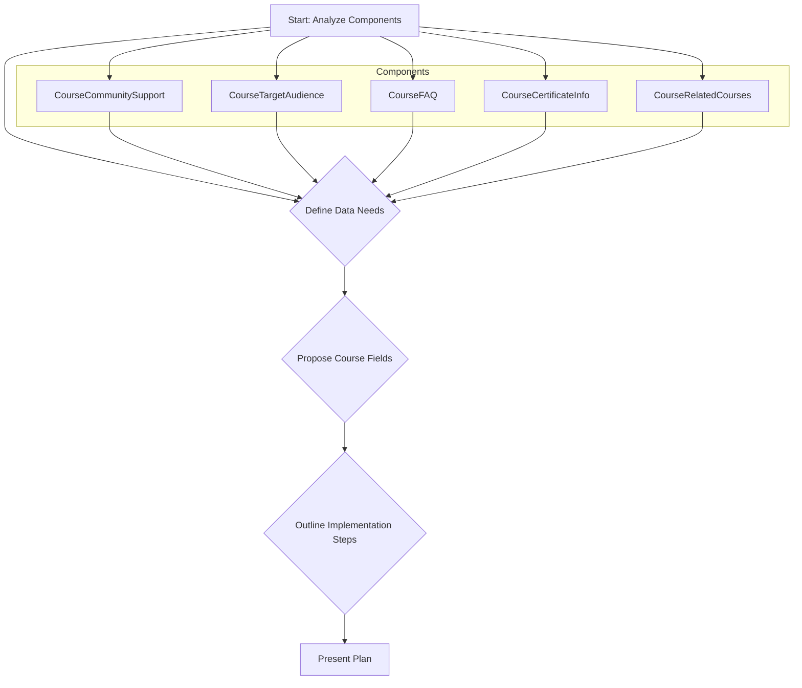

# Plan: Implementing Course Landing Page Components

This document outlines the plan for implementing placeholder components on the course landing page (`src/app/(frontend)/[lang]/courses/[slug]/page.tsx`). The focus is on defining necessary data structures within the `Courses` collection and outlining high-level implementation steps.

## Detailed Plan per Component

**1. `src/components/CourseCommunitySupport.tsx`**

*   **Purpose:** Inform users about community and support channels (e.g., Discord, forum, Q&A sessions).
*   **Data Requirements:** Headline, description, optional links.
*   **Proposed `Courses` Collection Fields (`src/collections/Courses/config.ts`):**
    *   `communitySupportTitle`: `text` (localized) - Optional section title.
    *   `communitySupportDescription`: `richText` (localized) - Detailed description.
    *   `communitySupportLinks`: `array` (localized) - Optional list of links.
        *   `label`: `text` - e.g., "Join Discord".
        *   `url`: `text` - The URL.
*   **Implementation Steps:**
    1.  Add fields to `src/collections/Courses/config.ts`.
    2.  Update data fetching in `src/app/(frontend)/[lang]/courses/[slug]/page.tsx`.
    3.  Modify `src/components/CourseCommunitySupport.tsx` to accept props and render data.

**2. `src/components/CourseTargetAudience.tsx`**

*   **Purpose:** Define the intended audience for the course.
*   **Data Requirements:** Headline, detailed description.
*   **Proposed `Courses` Collection Fields (`src/collections/Courses/config.ts`):**
    *   `targetAudienceTitle`: `text` (localized) - Optional section title.
    *   `targetAudienceDescription`: `richText` (localized) - Detailed description.
*   **Implementation Steps:**
    1.  Add fields to `src/collections/Courses/config.ts`.
    2.  Update data fetching in `src/app/(frontend)/[lang]/courses/[slug]/page.tsx`.
    3.  Modify `src/components/CourseTargetAudience.tsx` to accept props and render data.

**3. `src/components/CourseFAQ.tsx`**

*   **Purpose:** Answer frequently asked questions.
*   **Data Requirements:** Headline, list of question-answer pairs.
*   **Proposed `Courses` Collection Fields (`src/collections/Courses/config.ts`):**
    *   `faqTitle`: `text` (localized) - Optional section title.
    *   `faqs`: `array` (localized) - List of FAQs.
        *   `question`: `text` - The question.
        *   `answer`: `richText` - The answer.
*   **Implementation Steps:**
    1.  Add fields to `src/collections/Courses/config.ts`.
    2.  Update data fetching in `src/app/(frontend)/[lang]/courses/[slug]/page.tsx`.
    3.  Modify `src/components/CourseFAQ.tsx` to accept props and render data (e.g., using an accordion).

**4. `src/components/CourseCertificateInfo.tsx`**

*   **Purpose:** Provide details about the course certificate.
*   **Data Requirements:** Headline, certificate availability flag, description, optional preview image.
*   **Proposed `Courses` Collection Fields (`src/collections/Courses/config.ts`):**
    *   `certificateTitle`: `text` (localized) - Optional section title.
    *   `offersCertificate`: `checkbox` - Flag for certificate availability.
    *   `certificateDescription`: `richText` (localized) - Details and requirements (conditional).
    *   `certificatePreview`: `relationship` (to: 'media') - Optional image (conditional).
*   **Implementation Steps:**
    1.  Add fields to `src/collections/Courses/config.ts`.
    2.  Update data fetching in `src/app/(frontend)/[lang]/courses/[slug]/page.tsx` (populate relationship).
    3.  Modify `src/components/CourseCertificateInfo.tsx` to accept props and render conditionally.

**5. `src/components/CourseRelatedCourses.tsx`**

*   **Purpose:** Suggest other relevant courses.
*   **Data Requirements:** Headline, list of related courses.
*   **Proposed `Courses` Collection Fields (`src/collections/Courses/config.ts`):**
    *   `relatedCoursesTitle`: `text` (localized) - Optional section title.
    *   `relatedCourses`: `relationship` (relationTo: 'courses', hasMany: true) - List of related courses.
*   **Implementation Steps:**
    1.  Add fields to `src/collections/Courses/config.ts` (`hasMany: true`).
    2.  Update data fetching in `src/app/(frontend)/[lang]/courses/[slug]/page.tsx` (populate relationship sufficiently).
    3.  Modify `src/components/CourseRelatedCourses.tsx` to accept props and render related course cards/links.