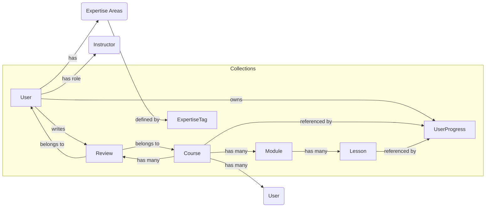

# Course Display Page Redesign: Architectural Plan

## 1. Goal

Replace the current layout-block-driven rendering of the Course Display Page (`/courses/[slug]`) with a flexible, component-based frontend architecture using dedicated data fields in Payload CMS.

## 2. Frontend Architecture (`src/app/(frontend)/[lang]/courses/[slug]/page.tsx`)

*   **Data Fetching:** Fetch structured course data server-side (SSR/ISR recommended).
*   **Component Structure:** Render dedicated React components, passing specific data props:
    *   `CourseHero`: Title, subtitle, key metadata, hero media, CTA.
    *   `CourseCurriculum`: Modules, lessons, progress indicators (client-side).
    *   `CourseInstructor`: Author information.
    *   `CourseReviews`: User reviews and ratings.
    *   `CoursePricing`: Pricing options, discounts.
    *   `CourseTimer`: Countdown timer (if applicable).
    *   `CourseOutcomes`: Learning objectives.
    *   `CourseDetails`: Format, prerequisites, etc.
*   **Client-Side Data:** Fetch user-specific data (e.g., `UserProgress`) client-side after authentication.

```mermaid
graph TD
    A[CoursePage (`page.tsx`)] --> B(CourseHero);
    A --> C(CourseCurriculum);
    A --> D(CourseInstructor);
    A --> E(CourseReviews);
    A --> F(CoursePricing);
    A --> G(CourseTimer);
    A --> H(CourseOutcomes);
    A --> I(CourseDetails);
```

## 3. Data Structure & Relationships

### 3.1. `Courses` Collection (`src/collections/Courses/config.ts`)

*   **Strategy:** Move content from layout blocks to dedicated fields.
*   **Key Fields:**
    *   `title` (text, required)
    *   `slug` (text, required, unique)
    *   `subtitle` (text)
    *   `heroMedia` (upload, relationTo: 'media')
    *   `modules` (relationship, relationTo: 'modules', hasMany: true)
    *   `learningOutcomes` (array of objects with `outcome`: text)
    *   `courseDescription` (richText)
    *   `instructors` (relationship, relationTo: 'users', hasMany: true, required: true, admin filter for 'instructor' role)
    *   `difficultyLevel` (select: Beginner, Intermediate, Advanced; required)
    *   `estimatedDuration` (text)
    *   `courseFormat` (select: Online Self-paced, Online Cohort-based, etc.)
    *   `prerequisites` (richText)
    *   `price` (relationship, relationTo: 'products', required: true)
    *   `enrollmentStartDate` (date)
    *   `enrollmentEndDate` (date)
    *   `averageRating` (number, admin readOnly, calculated)
    *   `totalReviews` (number, admin readOnly, calculated)
*   **Deprecated:** Mark old `layout` block field as read-only/deprecated during transition.

### 3.2. `Users` Collection (`src/collections/Users/config.ts`) - Instructor Handling

*   **Strategy:** Enhance the existing `Users` collection.
*   **Role Field:**
    *   `roles` (select, hasMany: true, options: 'admin', 'instructor', 'student', etc., required, defaultValue: ['student'], admin access control for changes).
*   **Instructor-Specific Fields (using `admin.condition` based on `roles`):**
    *   `instructorBio` (richText)
    *   `expertiseAreas` (relationship, relationTo: 'expertise-tags', hasMany: true)
    *   `qualifications` (textarea)
    *   `instructorProfilePicture` (upload, relationTo: 'media')
    *   `socialMediaLinks` (array of objects: `platform`: select, `url`: text)
*   **RBAC:** Implement Role-Based Access Control using `req.user.roles` checks.

### 3.3. `ExpertiseTags` Collection (`src/collections/ExpertiseTags.ts`)

*   **Purpose:** Manage instructor expertise tags centrally.
*   **Fields:** `name` (text, required, unique).
*   **Access Control:** Restrict `create`, `update`, `delete` access to Admins only for curation. Instructors select from existing tags via the `expertiseAreas` relationship field in their `User` profile.

### 3.4. Other Supporting Collections

*   **`Modules`:** `name`, `description`, `lessons` (relationship, relationTo: 'lessons', hasMany: true), `course` (relationship, relationTo: 'courses').
*   **`Lessons`:** `title`, `content` (richText/blocks), `video` (upload/url), `module` (relationship, relationTo: 'modules').
*   **`Reviews`:** `user` (relationship, relationTo: 'users'), `course` (relationship, relationTo: 'courses'), `rating` (number), `comment` (textarea), `status` (select: pending, approved, rejected).
*   **`UserProgress`:** `user` (relationship, relationTo: 'users'), `course` (relationship, relationTo: 'courses'), `completedLessons` (relationship, relationTo: 'lessons', hasMany: true), `lastAccessedLesson` (relationship, relationTo: 'lessons'). (Primarily for client-side interaction).

### 3.5. Data Relationships Diagram (Simplified)



## 4. Technical Considerations

*   **Performance:** Utilize specific field fetching (GraphQL depth, REST select), Payload/Next.js caching, CDN.
*   **Data Fetching Strategy:** Use SSR/ISR for core page data (`Course`, `Instructor`, initial `Reviews`). Use Client-Side Rendering (CSR) for user-specific data (`UserProgress`, subsequent `Reviews` pages, review submission).
*   **Accessibility (WCAG):** Build frontend components semantically (headings, landmarks, ARIA), ensure keyboard navigation, test contrast.
*   **Migration:** Develop Payload migration script(s) to transfer data from existing layout blocks to the new dedicated fields.

## 5. Next Steps

*   Implement the collection changes in Payload CMS (`payload.config.ts` and collection files).
*   Run Payload migrations to update the database schema.
*   Write data migration scripts and execute them.
*   Develop the new frontend components.
*   Build the Course Display Page (`page.tsx`) using the new components and data fetching strategy.
*   Test thoroughly (functionality, performance, accessibility).