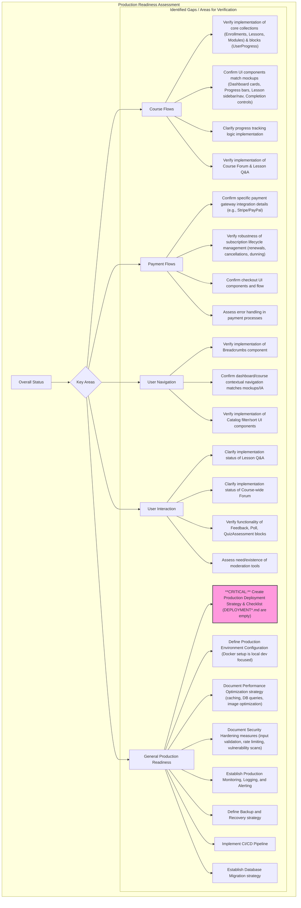

# Production Readiness Assessment (Initial Analysis)

Based on analysis of the file structure, `docs/information-architecture.md`, mockups (`docs/mockups/*`), and deployment-related files (`DEPLOYMENT*.md`, `DOCKER.md`) as of [Date of Analysis - Placeholder, e.g., 2025-05-01], the following potential gaps and areas require verification before production release:

## Visual Summary

## Detailed Summary of Gaps

1.  **Course Flows:**
    *   While collections (`CourseEnrollments`, `Lessons`, `Modules`) and blocks (`UserProgress`) seem planned, their actual implementation status needs verification.
    *   UI components (dashboard cards, progress bars, lesson navigation, completion controls) need confirmation against mockups.
    *   The logic for progress tracking requires clarification.
    *   Implementation status of the course-wide forum and lesson Q&A (mentioned in IA/mockups) is unclear.

2.  **Payment Flows:**
    *   Core services (`order`, `payment`, `subscription`) and collections (`Orders`, `subscriptions`) exist.
    *   Specific payment gateway integration details (e.g., Stripe/PayPal) need confirmation.
    *   Robustness of subscription lifecycle management (renewals, cancellations, dunning) needs verification.
    *   Checkout UI components and flow need confirmation.
    *   Error handling within payment processes needs assessment.

3.  **User Navigation:**
    *   Basic layout and routing structure seem present.
    *   Implementation of specific navigation components (breadcrumbs, contextual sidebars/tabs in dashboard/lesson views, catalog filter/sort UI) needs verification against IA/mockups.

4.  **User Interaction:**
    *   Blog comments exist.
    *   Status of lesson-specific Q&A and the course-wide forum is unclear.
    *   Functionality of interactive blocks (`Feedback`, `Poll`, `QuizAssessment`) needs verification.
    *   Need for and existence of moderation tools should be assessed.

5.  **Production Readiness:** (Significant Gaps)
    *   **Documentation:** `DEPLOYMENT_CHECKLIST.md` and `DEPLOYMENT.md` are empty. A documented production deployment strategy and checklist are missing.
    *   **Environment:** `DOCKER.md` describes a local development setup. Production environment configuration (scaling, security, etc.) is undefined.
    *   **Strategy:** Comprehensive strategies for performance optimization, security hardening, production monitoring/logging/alerting, backup/recovery, CI/CD, and database migrations appear to be missing.

This assessment provides a baseline for prioritizing tasks to achieve production readiness.