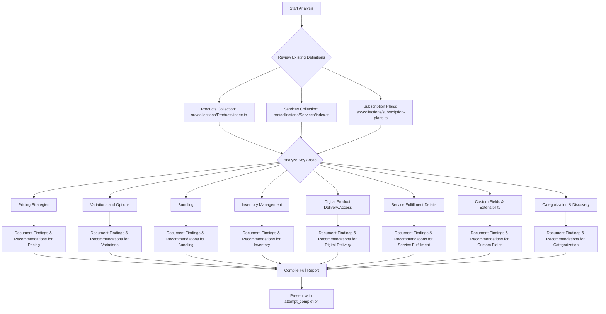

# Plan for Product & Service Configuration Analysis and Recommendations

This document outlines the plan to analyze the current setup of `Products` and `Services` within the system and recommend improvements or new configurations.

## Overall Approach

The analysis and recommendations will be structured based on the specific areas outlined in the task. For each area, the process will be:
1.  Describe the current state based on the reviewed collection definitions:
    *   `src/collections/Products/index.ts`
    *   `src/collections/Services/index.ts`
    *   `src/collections/subscription-plans.ts`
2.  Provide specific recommendations for enhancements, including potential new fields, relationships, or structural changes.
3.  Briefly outline the benefits of the proposed changes.

## Mermaid Diagram of the Plan

## Detailed Steps for Each Key Area:

### 1. Pricing Strategies
*   **Current State Assessment:**
    *   `Products`: Review `pricing` group (`basePrice`, `discountPercentage`, `finalPrice`, `compareAtPrice`). Note `locales` group for pricing (currently disabled). Examine `subscriptionDetails` (`recurringPrice`). Identify base currency (appears to be USD).
    *   `Services`: Review simple `price` field (USD). Examine `paymentSettings` for prepayment options.
    *   `SubscriptionPlans`: Review `price` and `currency` (RUB, USD, EUR), `period`.
*   **Recommendations to Explore:**
    *   Tiered pricing models (e.g., based on quantity, features).
    *   Volume discounts.
    *   Dynamic pricing capabilities (e.g., based on demand, user segment).
    *   Robust multi-currency support across all sellable items, including clear currency conversion and display logic.
    *   Localized pricing strategies beyond direct conversion.

### 2. Variations and Options
*   **Current State Assessment:**
    *   `Products`: Note lack of explicit general variation system. Consider `features` array as a basic form. `isCourse` as a type-specific variation.
    *   `Services`: `serviceType` as a primary variation. `features` array for further detailing.
*   **Recommendations to Explore:**
    *   A dedicated system for product/service variations (e.g., attributes like size, color, material).
    *   Options that modify price or SKU (e.g., add-ons, premium versions of a service level).
    *   Clear UI for selecting variations and options.

### 3. Bundling
*   **Current State Assessment:**
    *   Identify lack of explicit bundling mechanism. `relatedProducts` and `relatedServices` are for suggestions, not composite products.
*   **Recommendations to Explore:**
    *   Ability to define bundles composed of multiple products and/or services.
    *   Bundle-specific pricing (potentially discounted).
    *   Inventory management for bundles (if components have stock).

### 4. Inventory Management (if applicable)
*   **Current State Assessment:**
    *   Note absence of explicit inventory tracking fields (e.g., stock count, SKU) in `Products` or `Services`.
*   **Recommendations to Explore:**
    *   Fields for stock levels (if physical products or capacity-limited services are envisioned).
    *   Stock Keeping Units (SKUs) for products and variations.
    *   Out-of-stock handling and display logic.
    *   Low stock notifications.

### 5. Digital Product Delivery/Access
*   **Current State Assessment:**
    *   `Products`: `downloadLink` for `productType: 'digital'`. `accessDetails` for `productType: 'access'` (features, validity period).
*   **Recommendations to Explore:**
    *   Enhanced integration with access control or entitlement systems.
    *   Management of license keys or unique access codes.
    *   Versioning for digital products (e.g., software, e-books).
    *   Streaming or secure content delivery mechanisms.

### 6. Service Fulfillment Details
*   **Current State Assessment:**
    *   `Services`: `requiresBooking` and `bookingSettings` (Calendly integration, custom form fields via `additionalInfoFields`). `duration` field.
*   **Recommendations to Explore:**
    *   Fields for assigning service providers (if applicable beyond a single Calendly user per service).
    *   Status tracking for non-bookable services or longer projects (e.g., 'in progress', 'pending client review').
    *   Storage for service-specific requirements, documents, or deliverables.
    *   More granular scheduling options if `internal` booking provider is to be developed.

### 7. Custom Fields and Extensibility
*   **Current State Assessment:**
    *   `Products`/`Services`: `features` array offers some flexibility. `meta` group for SEO.
    *   `SubscriptionPlans`: `metadata` (JSON field) for unstructured custom data.
*   **Recommendations to Explore:**
    *   A more standardized or enhanced approach for adding custom attributes (e.g., a dedicated 'custom fields' block or a more structured EAV-like model).
    *   Ability to define field types for custom attributes (text, number, date, select).
    *   Making custom fields searchable/filterable.

### 8. Categorization and Discovery
*   **Current State Assessment:**
    *   `Products`: `productCategory` (single relationship). `isFeatured`, `isPopular` flags. `meta` for SEO.
    *   `Services`: `serviceType` (select field). `meta` for SEO.
*   **Recommendations to Explore:**
    *   More robust tagging system (many-to-many relationship with a `Tags` collection).
    *   Support for multiple categorization schemes (e.g., by use case, by target audience, in addition to product type).
    *   Defining attributes that can be used for faceted search/filtering on the front-end.
    *   Improved internal search capabilities within the admin panel based on these new attributes.

This plan will guide the detailed analysis and the formulation of actionable recommendations.