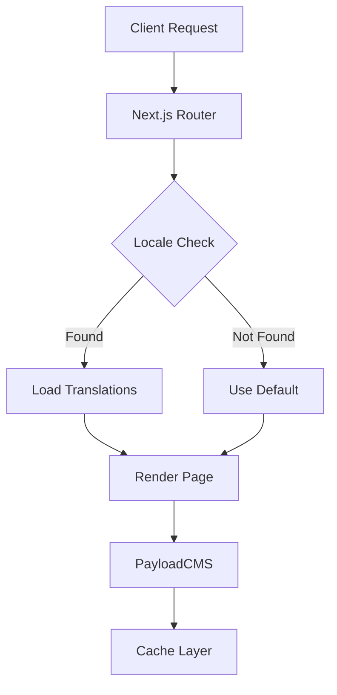

# Localization Guide

## Server vs Client Components

### Server Components
```typescript
// app/[lang]/page.tsx
import { headers } from 'next/headers'

export default async function Page() {
  // Server-side operations
  const headersList = headers()
  const locale = headersList.get('x-locale') || 'en'
  
  return (
    <main>
      {/* Server Components here */}
    </main>
  )
}
```

### Client Components
```typescript
'use client'

// components/LocaleSwitcher.tsx
import { useRouter } from 'next/navigation'

export default function LocaleSwitcher() {
  const router = useRouter()
  
  return (
    <select onChange={(e) => router.push(`/${e.target.value}`)}>
      <option value="en">English</option>
      <option value="es">Español</option>
    </select>
  )
}
```

## Dependencies

Required packages from package.json:
```json
{
  "dependencies": {
    "@formatjs/intl-localematcher": "^0.6.0",
    "@payloadcms/plugin-form-builder": "^3.28.1",
    "@payloadcms/plugin-seo": "^3.28.1",
    "@payloadcms/richtext-lexical": "^3.28.1"
  }
}
```

## Integration with PayloadCMS

The system integrates with PayloadCMS collections:
- Automatically handles localized fields
- Supports rich text content
- Works with media references
- Handles nested relationships

Example collection configuration:
```typescript
{
  slug: 'posts',
  fields: [
    {
      name: 'title',
      type: 'text',
      localized: true
    }
  ]
}
```

## Monitoring and Maintenance

1. **Regular Monitoring**
   - Check cache hit rates
   - Monitor error rates
   - Review performance metrics
   - Verify cache size

2. **Maintenance Tasks**
   - Clear cache periodically
   - Update preload content list
   - Review and update fallback content
   - Monitor disk usage for cache files

## Troubleshooting

Common issues and solutions:

1. **Missing Translations**
   - Check if locale is supported
   - Verify content exists in default locale
   - Review fallback configuration

2. **Performance Issues**
   - Monitor cache hit rates
   - Check average fetch times
   - Verify preloading configuration
   - Review cache size limits

3. **Cache Problems**
   - Check disk permissions
   - Verify cache file location
   - Monitor memory usage
   - Review cache configuration

## Data Flow



## Environment Setup

```bash
# Required environment variables
NEXT_PUBLIC_DEFAULT_LOCALE=en
NEXT_PUBLIC_SUPPORTED_LOCALES=en,es,fr
PAYLOAD_PUBLIC_SERVER_URL=http://localhost:3000
```

## Revalidation Strategy

For content updates:
```typescript
// Revalidate specific paths
await revalidatePath(`/${locale}/${slug}`)

// Revalidate tags
await revalidateTag(`content-${locale}`)
```

## Error Handling

```typescript
try {
  const content = await fetchLocalizedContent(locale, slug)
  if (!content) {
    throw new Error(`Content not found for ${locale}/${slug}`)
  }
  return content
} catch (error) {
  console.error(`Localization error: ${error.message}`)
  return fallbackContent
}
```

## Best Practices

1. **Content Structure**
   - Use flat translation keys
   - Maintain consistent naming
   - Document fallback logic

2. **Performance**
   - Implement proper caching
   - Use incremental static regeneration
   - Optimize bundle size

3. **Development**
   - Follow type-safe patterns
   - Maintain test coverage
   - Document edge cases
